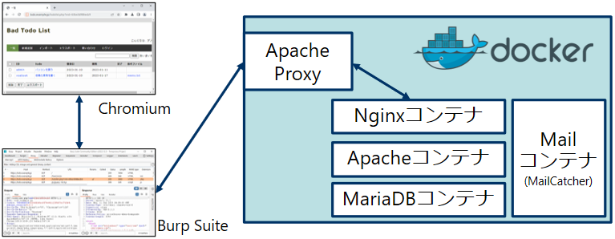
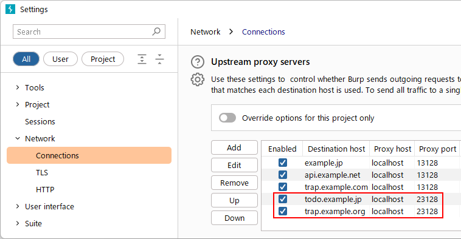
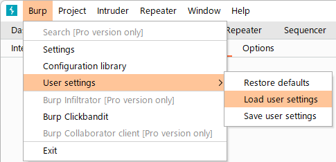
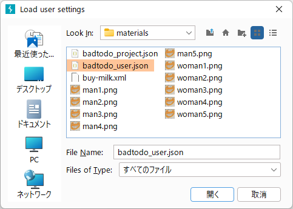
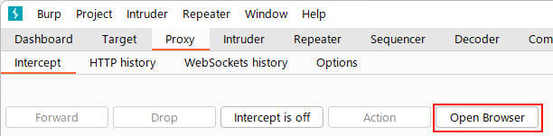
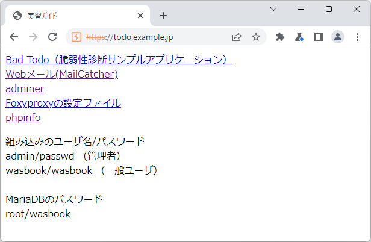

# Dockerコンテナのダウンロード、設置、起動方法

githubからgit cloneするか、adtodo.zipをダウンロードして、以下のコマンドによるコンテナーのビルド及び実行をします。

```
$ cd 適当なディレクトリ
$ git clone https://github.com/ockeghem/badtodo.git
$ cd badtodo
$ docker compose up -d
```
または badtodo.zip をダウンロードして

```
$ cd 適当なディレクトリ
$ unzip badtodo.zip   # badtodo.zipのディレクトリ指定は行ってください
$ cd badtodo
$ docker compose up -d
```

イメージのビルドが開始され、その後コンテナが起動します。

デフォルトの設定では、Nginx（リバースプロキシ）とApacheのフォワードプロキシのポートのみが公開されています。利用者はこのPROXY経由で実習環境にアクセスする形になります。

# お勧めの使い方の設定（PROXY経由）

このアプリケーションのお勧めの使い方は、Burp SuiteのUpstream proxy serversとしてapacheコンテナが提供するPROXY（フォワードプロキシ）を介して実習環境に接続する方法です（下図）。




以下のホスト、ポートを指定してください。

IP: 127.0.0.1
Port: 23128 （.envにより変更可能、後述）

指定後の様子を以下に示します。



この設定を容易にするために、設定ファイルを用意しました。materials/badtodo_user.jsonをBurp Suiteにてインポートしてください。Burpメニューから、User settings → Load user settings



ファイル選択ダイアログで materials\badtodo_user.json を選択します。



実習環境はtodo.example.jpなどのホスト名を使いますが、これらの名前解決はPROXY側で行うため、お手元の端末（Dockerホスト）ではhostsファイル等の設定は必要ありません。

この状態で、https://todo.example.jp/ をアクセスしてください。お勧めはBurp Suiteに組込のChromiumを使う方法です。これですと、利用者側でブラウザのプロキシ設定は必要ありません。
具体的には、画面上部のProxyタブ→Interceptタブ→Open Browserボタンを押してください。


Chromiumでhttps://todo.example.jp/を表示した様子を示します。ここから実習が可能になります。




# PROXYを経由しない設定方法

PROXYを経由せずに直接Webサイトにアクセスするには、以下のURLにアクセスしてください。

http://127.0.0.1:4080/todo/

または

https://localhost:4443/todo/

やはりBurp Suite組み込みのChromiumの使用をお勧めしますが、ブラウザ側のProxy設定をすれば、Firefox等お好きなブラウザを使うことも可能です。

ウェブサイトのIPアドレスやポートを変更するには以下のようにします。
まず、付属のenv_exampleを .env にリネーム（あるいはコピー）して、.envを編集します。

```
# WebサーバーのIPアドレスを192.168.0.5に変更する例
WEB_IP=192.168.0.5
# WebサーバーのHTTPポートを8888に変更する例
WEB_HTTP_PORT=8888
# WebサーバーのHTTPSポートを40443に変更する例
WEB_HTTPS_PORT=40443
```


# PROXYのポート変更方法

実習環境の入り口であるPROXYのポートはデフォルトでは23128ですが、変更することもできます。以下は 8888 にて待ち受けする例です。

```
$ cp env_example .env
# .envを以下のように修正

# 通常利用するPROXY（フォワードプロキシ）のポート
# APACHE_PROXY_PORT=23128
　　↓ コメントアウトしてポートを変更
# 通常利用するPROXY（フォワードプロキシ）のポート
APACHE_PROXY_PORT=8888

# 後は普通に実行
$ docker compose up -d
```

Dockerコンテナを起動した後にポートを変更する場合は、上記の変更をした後、いったんapacheコンテナを削除してからdocker compose up -dを実行してください。
